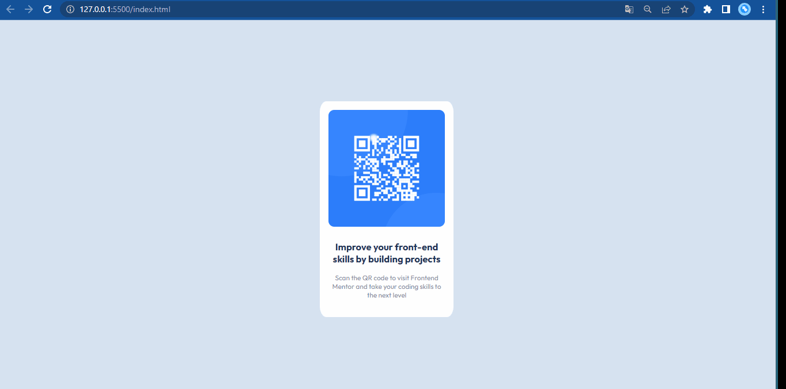

# Frontend Mentor - solução de componente de código QR


## Índice

- [Visão geral](#visão-geral)
  - [Captura de tela](#captura-de-tela)
  - [Links](#links)
- [Meu processo](#meu-processo)
  - [Construído com](#construído-com)
  - [O que aprendi](#o-que-aprendi)
  - [Desenvolvimento contínuo](#desenvolvimento-contínuo)
  - [Recursos úteis](#useful-resources)
- [Autor](#autor)
- [Agradecimentos](#agradecimentos)


## Visão geral

### Captura de tela

[]

### Links


- URL do site ao vivo: [Adicione o URL do site ao vivo aqui](https://your-live-site-url.com)

## Meu processo

### Construído com

- Marcação HTML5 semântica
- Propriedades personalizadas de CSS
- Flexbox

## O que eu aprendi

Com esse projeto consegui por em prática tudo o que aprendi sobre HTML e CSS, utilizanto tegs semmânticas e propriedades CSS, criando-se assim uma página acessível e responsíva, facilitando a visualização tanto em Desktop, como em celulares.  
```html
<body>
  <main>
    <header>
      <h1>Título 1</h1>
      <nav>
        <ul>
          <li></li>
          <li></li>
          <li></li>
        </ul>
      </nav>
    </header>
    <section>
      <h2>Título 2</h1>
      <p>Conteúdo</p>
    </section>
  </main>
  <footer></footer>
</body>
```
``` css
main {
    background-color: hsl(0, 0%, 100%);
    min-width: 290px;
    max-width: 900px;
    width: 700px;
    height: 520px;
    position: absolute;
    bottom: 0;
    left: 0;
    right: 0;
    top: 0;
    margin: auto;
    border-radius: 3%;
}
```
### Desenvolvimento contínuo

Objetivos futuros

- Me especializar mais a fundo em HTML e CSS;
- Aprender JavaScript.

### Recursos úteis

- [Guia completo para o flex-box](https://css-tricks.com/snippets/css/a-guide-to-flexbox/) - Esse guia me ajudou bastante na hora de fazer os posicionamentos dos itens e containers. Gostei muito e vou usá-lo daqui para frente.

## Autor

- Meu GitHub- [toncardoso](https://www.your-site.com)
- Meu perfil Frontendmentor - [@toncardoso](https://www.frontendmentor.io/profile/toncardoso)

## Agradecimentos

- https://www.youtube.com/c/devemdobro
- https://www.youtube.com/c/rafaellaballerini